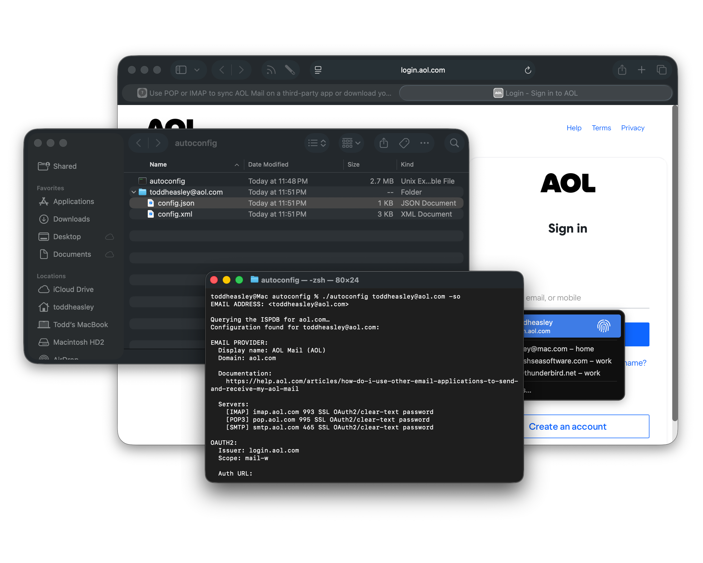

# Feature Libraries

## `Autoconfiguration`

[Thunderbird Autoconfiguration](https://www.bucksch.org/1/projects/thunderbird/autoconfiguration), often just "autoconfig," is an XML syndication format where email service providers advertise public mail server settings.

### Library

`Autoconfigruation` library is designed to support email account setup in its parent project, [Thunderbird for iOS](https://github.com/thunderbird/thunderbird-ios), via `URLSession` data task:

```swift
import Autoconfiguration
import Foundation

let example: (config: ClientConfig, source: Source) = try await URLSession.shared.autoconfig("user123@aol.com")
```

Taking the default arguments, the above returns mail server settings for almost every email address in existence. Here's how it works:

1. Query all sources using the domain name from the given email address. If more than one client configuration is found, prefer the provider-provided configuration over the [Thunderbird "ISPDB" autoconfig database.](https://github.com/thunderbird/autoconfig)
2. If no configuration is found, the given email address is probably using a custom domain. Query [MX records](https://en.wikipedia.org/wiki/MX_record) for an underlying domain name, then re-query all sources using the underlying domain name.

MX records can be queried directly:

```swift
import Autoconfiguration

let records: [MXRecord] = try await DNSResolver.queryMX("thunderbird.net")
```

#### Domain Parsing

`Autoconfiguration` library uses the [Public Suffix List](https://publicsuffix.org) to parse domains from DNS host names:

```swift
import Autoconfiguration
import Foundation

let domain: String = try await URLSession.shared.domain(host: "smtp01.mail.example.com")
print(domain)  // "example.com"
```

#### Autodiscover(y)

`Autoconfiguration` supports [DNS service autodiscovery]((https://en.wikipedia.org/wiki/SRV_record)) for protocols like [JMAP](https://jmap.io) that don't use autoconfig:

```swift
import Autoconfiguration

let records: [SRVRecord] = try await DNSResolver.querySRV("example@thundermail.com")
```

[Autodiscover for Exchange](https://learn.microsoft.com/en-us/exchange/client-developer/exchange-web-services/autodiscover-for-exchange) is not supported at this time. Local and [MDM](https://support.apple.com/guide/deployment/welcome/web) configurations are not supported yet. 

`Autoconfiguration` library depends on the [Swift Asynchronous DNS Resolver.](https://github.com/apple/swift-async-dns-resolver)

### Command-line interface

`autoconfig` is a bundled CLI demo of `Autoconfiguration` library:

```zsh
./autoconfig toddheasley@aol.com -so
```

Email address is a required argument, plus two flags:

* `--save`: Save original config XML and JSON files to app working directory.
* `--open`: Open all config URLs in a browser; if saving, show files in Finder.



## `IMAP` and `SMTP`

Thunderbird supports sending and receiving email for most email providers through [Internet Message Access Protocol](https://wikipedia.org/wiki/Internet_Message_Access_Protocol) (IMAP) and [Simple Mail Transfer Protocol](https://en.wikipedia.org/wiki/Simple_Mail_Transfer_Protocol) (SMTP).

Both protocols use [TCP](https://en.wikipedia.org/wiki/Transmission_Control_Protocol) for transport, not HTTP; both libraries are built on top of [SwiftNIO.](https://opensource.apple.com/projects/swiftnio)

### `IMAP` Library


### `SMTP` Library

`SMTP` implementation is based on `NIOSMTP` example project included in the [SwiftNIO examples.](https://github.com/apple/swift-nio-examples) 

## `JMAP`

[JSON Meta Application Protocol](https://jmap.io) (JMAP)) is a modern, API-based approach to email that uses standard HTTP requests and responses with JSON serialization for transit.

`JMAP` feature library is a _client_ implementation of both [JMAP core](https://jmap.io/spec-core.html) and [JMAP mail](https://jmap.io/spec-mail.html) protocols, with functionality tailored for use in [Thunderbird for iOS.](https://github.com/thunderbird/thunderbird-ios)
